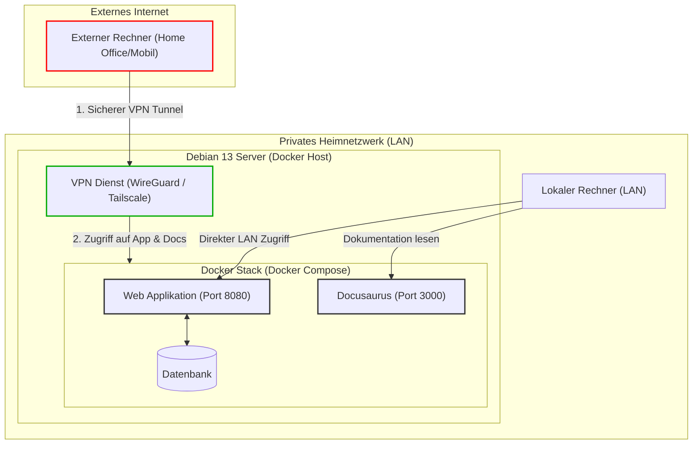

## Credits to:

- [Bootstrap Template SB-Admin-2](https://startbootstrap.com/theme/sb-admin-2)
- [Github SB-Admin-2](https://github.com/StartBootstrap/startbootstrap-sb-admin-2/tree/master)
- [AwesomeFonts-Free Package](https://rfontawesome.com/search)
- [Springboot](https://docs.spring.io/spring-boot/index.html)
- [Maven](https://maven.apache.org/guides/)
- [JSP - JavaServerPages](https://docs.oracle.com/javaee/5/tutorial/doc/bnajo.html)
- [Docker Compose](https://docs.docker.com/compose/)
- [Dockerfile](https://docs.docker.com/build/concepts/dockerfile/)
- [Bash Script](https://www.freecodecamp.org/news/shell-scripting-crash-course-how-to-write-bash-scripts-in-linux/)
- AI: Gemini, Perplexity, ChatGPT
- StackOverflow