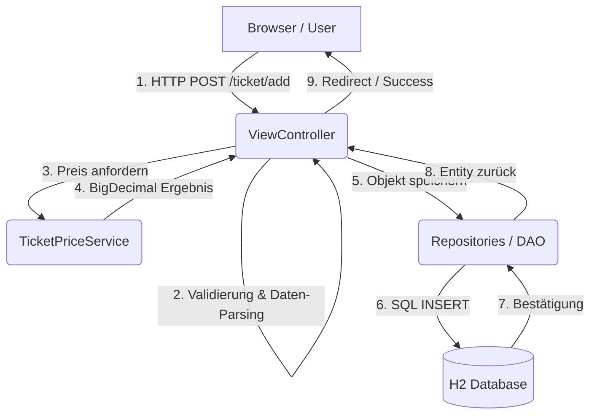

# Datenfluss: Vom Browser zur Datenbank

Um zu verstehen, wie die Lotto-Applikation arbeitet, hilft ein Blick auf den Weg, den eine Anfrage (z. B. "Ticket
speichern") durch die verschiedenen Schichten nimmt.

## Architektur-Diagramm

Hier ist der Prozess vereinfacht dargestellt:

